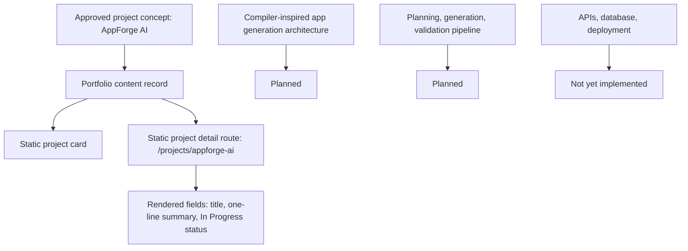

# AppForge AI

---

## One-line Summary

AppForge AI is a compiler-inspired AI application generation platform.

---

## Elevator Pitch

AppForge AI is documented in this repository as an in-progress AI product direction focused on compiler-inspired application generation. The approved description is limited to one sentence: "Compiler-inspired AI application generation platform."

The project appears as one of the portfolio's four featured projects and signals interest in AI agents, generative AI, software systems, and product-oriented engineering. The repository does not yet contain a separate AppForge AI codebase, compiler pipeline, intermediate representation, model orchestration, generated application runtime, API layer, database schema, deployment setup, repository URL, demo URL, screenshots, metrics, or outcomes.

This case study is deliberately conservative. It captures the project direction and the implementation gaps that must be filled with source-backed evidence before the project can be evaluated as a built system.

---

## Problem Statement

Repository-defined problem statement: Planned.

The approved documents define the problem domain as AI application generation. They do not define:

- Target users.
- Input format.
- Output application type.
- Compiler-inspired stages.
- Validation or execution strategy.
- Safety constraints.
- Runtime environment.
- Current solution limitations.

Why this project was created: Planned.

---

## Goals

### Primary Goals

- Planned.
- The only source-backed goal is to represent an in-progress AI systems project within the portfolio.

### Non-goals

- Do not claim AppForge AI generates working applications, compiles prompts, runs code, validates builds, deploys apps, or uses agents until documented.
- Do not claim production use, benchmark results, repository availability, demo availability, or user adoption until source-backed.
- Do not add technical stack, model pipeline, or architecture claims before implementation evidence exists.

### Design Philosophy

Source-backed portfolio philosophy that applies to this project:

- Products over isolated models.
- Systems over demos.
- Architecture over screenshots.
- Understanding over memorization.
- Research before implementation.
- Execution over ideas.

Project-specific design philosophy: Planned.

---

## System Overview

Current status: In Progress.

High-level system behavior: Not yet implemented.

The repository currently represents AppForge AI as static portfolio content:

- Name: AppForge AI.
- Slug: `appforge-ai`.
- Description: Compiler-inspired AI application generation platform.
- Status: In Progress.
- Portfolio route: `/projects/appforge-ai`.

Who uses it: Planned.

Expected workflow: Planned.

---

## Architecture

Project architecture: Not yet implemented.

The repository does not define compiler stages, parsing, planning, intermediate representation, code generation, validation, sandboxing, model orchestration, persistence, APIs, or deployment topology.

Current portfolio architecture for presenting this project:

- `content/projects.ts` stores the source-backed project record.
- `app/projects/[slug]/page.tsx` statically generates the detail route.
- `ProjectHeader` renders only the project name, one-line description, and status.
- `NavigationBetweenProjects` provides static previous/next project links.

Major subsystems: Planned.

Data flow: Planned.

Request flow: Planned.

Model pipeline: Planned.

Orchestration: Planned.

---

## Architecture Diagram



---

## End-to-End Workflow

### Current Portfolio Workflow

Input

Portfolio visitor opens `/projects` or `/projects/appforge-ai`.

Processing

The Next.js static route reads the AppForge AI record from `content/projects.ts`.

Output

The page displays the project title, one-line description, status, and project navigation.

### AppForge AI Product Workflow

Input: Planned.

Processing: Planned.

Output: Planned.

---

## Core Features

### Current Source-backed Feature

AppForge AI is listed as a featured in-progress project in the portfolio.

Why it exists: It supports the portfolio's project-first hierarchy and communicates a current AI product direction around application generation.

### Planned Features

Project-specific features are not yet implemented or documented.

Do not infer features such as prompt compilation, code generation, app scaffolding, agent planning, sandbox execution, automated testing, deployment, or template generation until source documents define them.

---

## Technical Stack

### Project Implementation Stack

| Area | Status |
| --- | --- |
| Languages | Not yet implemented |
| Frameworks | Not yet implemented |
| Models | Not yet implemented |
| Libraries | Not yet implemented |
| Database | Not yet implemented |
| Deployment | Not yet implemented |
| Infrastructure | Not yet implemented |

### Repository-backed Portfolio Stack

The portfolio that presents AppForge AI uses:

- Next.js App Router.
- React.
- TypeScript.
- Tailwind CSS.
- Static generation.
- Vitest and React Testing Library.
- Local typed content modules.

These are portfolio technologies, not evidence of the AppForge AI product implementation.

---

## Engineering Decisions

### Decision: Keep project details minimal until source-backed

Problem: The project concept suggests a complex generation system, but the repository does not yet document the implementation.

Options considered:

- Invent compiler or agent architecture.
- Omit the project.
- Render only source-backed fields.

Chosen solution: Render only the approved title, one-line description, and `In Progress` status.

Tradeoffs:

- Preserves credibility and avoids unsupported claims about generated applications.
- Leaves the case study incomplete until actual architecture and implementation details are provided.

### Project-specific engineering decisions

Planned.

---

## AI / ML Pipeline

Model selection: Planned.

Embeddings: Planned.

Retrieval: Planned.

Ranking: Planned.

Inference: Planned.

Evaluation: Planned.

Caching: Planned.

Optimization: Planned.

No AI / ML pipeline implementation for AppForge AI exists in this repository.

---

## Folder Structure

### Current Repository Representation

```text
content/projects.ts
types/project.ts
app/projects/[slug]/page.tsx
features/projects/components/ProjectHeader.tsx
features/projects/components/ProjectCard.tsx
features/projects/components/ProjectGrid.tsx
features/projects/components/NavigationBetweenProjects.tsx
```

### AppForge AI Product Repository

Not yet implemented.

---

## APIs

AppForge AI APIs: Not yet implemented.

No endpoints, request contracts, response contracts, authentication model, rate limits, or API clients are documented in this repository.

---

## Database

Database: Not yet implemented.

Schema: Planned.

Entities: Planned.

Relationships: Planned.

The repository does not define persistence requirements for prompts, generated applications, build artifacts, execution logs, user sessions, or templates.

---

## Challenges

Documented engineering challenges: Not yet implemented.

Known documentation challenge:

- A compiler-inspired AI generation platform requires precise architecture before credible claims can be made, but the repository only documents the project name, summary, and status.

How solved:

- Current portfolio implementation avoids unsupported claims and keeps details minimal until source-backed content exists.

---

## Scalability

Current limitations:

- No product architecture is documented.
- No generation pipeline is documented.
- No execution or validation model is documented.
- No deployment model is documented.
- No scale targets are documented.

Future scaling strategy: Planned.

---

## Performance

Project-specific performance work: Not yet implemented.

Optimization techniques: Planned.

No generation latency, build time, execution cost, reliability, or benchmark data is documented.

---

## Security

Authentication: Not yet implemented.

Validation: Planned.

Rate limiting: Planned.

Input sanitization: Planned.

Secrets: Not yet implemented.

Because application generation may involve code execution or generated artifacts, sandboxing and validation must be explicitly documented before implementation claims are made. Current repository details: Planned.

---

## Testing

Project-specific testing strategy: Not yet implemented.

Coverage: Not yet implemented.

Current portfolio tests validate that AppForge AI exists in the project content list with `In Progress` status.

---

## Deployment

Local: Not yet implemented for the AppForge AI product.

Docker: Not yet implemented for the AppForge AI product.

Production: Not yet implemented.

CI/CD: Not yet implemented.

Only the static portfolio route exists in this repository.

---

## Current Progress

### Completed

- Listed as a featured portfolio project.
- Static project detail route exists.
- Name, slug, one-line description, and status are source-backed.

### In Progress

- Project status is documented as `In Progress`.

### Planned

- Product architecture.
- Feature specification.
- AI / ML pipeline.
- Compiler-inspired pipeline design.
- API design.
- Database design.
- Security and sandboxing model.
- Deployment strategy.
- Repository URL.
- Demo URL.
- Screenshots, diagrams, and code snippets.

---

## Roadmap

### Near-term

- Define source-backed user workflow.
- Document actual generation pipeline.
- Define validation and safety boundaries if code generation or execution exists.
- Add repository and demo links only after approved.

### Long-term

- Planned.

---

## Lessons Learned

Engineering lessons: Planned.

Architecture lessons: Planned.

Product lessons: Planned.

No implementation lessons are documented yet.

---

## Future Improvements

- Replace planned sections with source-backed implementation details.
- Add actual architecture diagram.
- Add API contracts if APIs are implemented.
- Add database schema if persistence is implemented.
- Add model pipeline details if AI / ML components are implemented.
- Add testing and deployment evidence once available.

---

## Repository

GitHub link: Not yet implemented.

The global profile GitHub link is `https://github.com/HrshJha`, but no AppForge AI repository URL is documented.

---

## Recruiter Takeaways

- AppForge AI is an in-progress project direction: compiler-inspired AI application generation platform.
- The current repository does not document generator architecture, code execution, APIs, model pipeline, demo, or repository link.
- The portfolio presents it with source-backed status instead of unsupported claims.
- The next credibility step is adding real architecture and implementation evidence.
