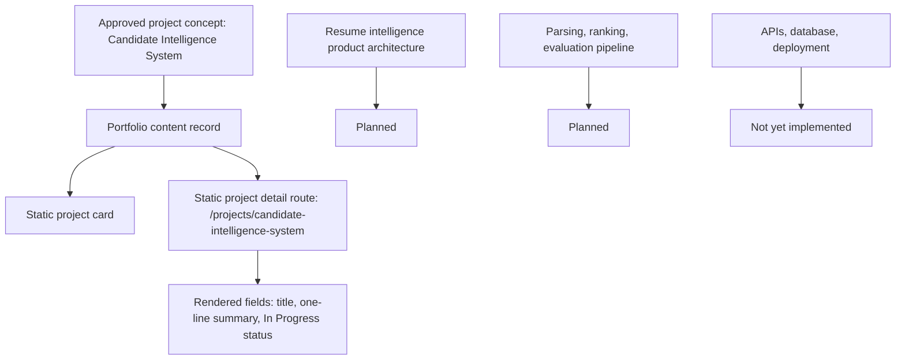

# Candidate Intelligence System

---

## One-line Summary

Candidate Intelligence System is an AI-powered resume intelligence platform.

---

## Elevator Pitch

Candidate Intelligence System is documented in this repository as an in-progress AI product direction focused on resume intelligence. The approved description is limited to one sentence: "AI-powered resume intelligence platform."

The project appears as one of the portfolio's four featured projects and supports the portfolio's project-first evaluation model. The repository does not yet contain a separate implementation codebase, project-specific system architecture, resume parsing logic, model selection, ranking workflow, database schema, API contracts, repository URL, demo URL, screenshots, metrics, or outcomes.

This case study therefore records what is known and what remains planned. It should be read as a technical planning artifact for a project direction, not as proof that a complete resume intelligence product has been shipped.

---

## Problem Statement

Repository-defined problem statement: Planned.

The approved documents define the problem domain as resume intelligence. They do not define:

- Target users.
- Resume input formats.
- Candidate evaluation criteria.
- Hiring workflow.
- Current solution limitations.
- Bias, safety, or explainability requirements.
- Evaluation methodology.

Why this project was created: Planned.

---

## Goals

### Primary Goals

- Planned.
- The only source-backed goal is to represent an in-progress AI systems project within the portfolio.

### Non-goals

- Do not claim the system ranks candidates, parses resumes, extracts entities, scores fit, integrates with ATS tools, or makes hiring decisions until documented.
- Do not claim production use, user validation, model accuracy, benchmark results, or fairness evaluation until source-backed.
- Do not add repository, demo, screenshots, metrics, or architecture claims before approval.

### Design Philosophy

Source-backed portfolio philosophy that applies to this project:

- Products over isolated models.
- Systems over demos.
- Architecture over screenshots.
- Understanding over memorization.
- Research before implementation.
- Execution over ideas.

Project-specific design philosophy: Planned.

---

## System Overview

Current status: In Progress.

High-level system behavior: Not yet implemented.

The repository currently represents Candidate Intelligence System as static portfolio content:

- Name: Candidate Intelligence System.
- Slug: `candidate-intelligence-system`.
- Description: AI-powered resume intelligence platform.
- Status: In Progress.
- Portfolio route: `/projects/candidate-intelligence-system`.

Who uses it: Planned.

Expected workflow: Planned.

---

## Architecture

Project architecture: Not yet implemented.

The repository does not define candidate ingestion, resume parsing, document preprocessing, embeddings, retrieval, ranking, scoring, explanation generation, persistence, APIs, or deployment topology.

Current portfolio architecture for presenting this project:

- `content/projects.ts` stores the source-backed project record.
- `app/projects/[slug]/page.tsx` statically generates the detail route.
- `ProjectHeader` renders only the project name, one-line description, and status.
- `NavigationBetweenProjects` provides static previous/next project links.

Major subsystems: Planned.

Data flow: Planned.

Request flow: Planned.

Model pipeline: Planned.

Orchestration: Planned.

---

## Architecture Diagram



---

## End-to-End Workflow

### Current Portfolio Workflow

Input

Portfolio visitor opens `/projects` or `/projects/candidate-intelligence-system`.

Processing

The Next.js static route reads the Candidate Intelligence System record from `content/projects.ts`.

Output

The page displays the project title, one-line description, status, and project navigation.

### Candidate Intelligence System Product Workflow

Input: Planned.

Processing: Planned.

Output: Planned.

---

## Core Features

### Current Source-backed Feature

Candidate Intelligence System is listed as a featured in-progress project in the portfolio.

Why it exists: It supports the portfolio's project-first hierarchy and communicates a current AI product direction around resume intelligence.

### Planned Features

Project-specific features are not yet implemented or documented.

Do not infer features such as resume parsing, candidate ranking, job matching, entity extraction, ATS integration, scoring, summarization, or interview recommendation until source documents define them.

---

## Technical Stack

### Project Implementation Stack

| Area | Status |
| --- | --- |
| Languages | Not yet implemented |
| Frameworks | Not yet implemented |
| Models | Not yet implemented |
| Libraries | Not yet implemented |
| Database | Not yet implemented |
| Deployment | Not yet implemented |
| Infrastructure | Not yet implemented |

### Repository-backed Portfolio Stack

The portfolio that presents Candidate Intelligence System uses:

- Next.js App Router.
- React.
- TypeScript.
- Tailwind CSS.
- Static generation.
- Vitest and React Testing Library.
- Local typed content modules.

These are portfolio technologies, not evidence of the Candidate Intelligence System product implementation.

---

## Engineering Decisions

### Decision: Keep project details minimal until source-backed

Problem: The project is listed as in progress, but implementation details are missing.

Options considered:

- Invent candidate intelligence features.
- Omit the project.
- Render only source-backed fields.

Chosen solution: Render only the approved title, one-line description, and `In Progress` status.

Tradeoffs:

- Preserves credibility and avoids unsupported hiring-product claims.
- Leaves the case study incomplete until real implementation details exist.

### Project-specific engineering decisions

Planned.

---

## AI / ML Pipeline

Model selection: Planned.

Embeddings: Planned.

Retrieval: Planned.

Ranking: Planned.

Inference: Planned.

Evaluation: Planned.

Caching: Planned.

Optimization: Planned.

No AI / ML pipeline implementation for Candidate Intelligence System exists in this repository.

---

## Folder Structure

### Current Repository Representation

```text
content/projects.ts
types/project.ts
app/projects/[slug]/page.tsx
features/projects/components/ProjectHeader.tsx
features/projects/components/ProjectCard.tsx
features/projects/components/ProjectGrid.tsx
features/projects/components/NavigationBetweenProjects.tsx
```

### Candidate Intelligence System Product Repository

Not yet implemented.

---

## APIs

Candidate Intelligence System APIs: Not yet implemented.

No endpoints, request contracts, response contracts, authentication model, rate limits, or API clients are documented in this repository.

---

## Database

Database: Not yet implemented.

Schema: Planned.

Entities: Planned.

Relationships: Planned.

The repository does not define persistence requirements for resumes, candidates, jobs, evaluations, embeddings, or reports.

---

## Challenges

Documented engineering challenges: Not yet implemented.

Known documentation challenge:

- Resume intelligence systems can imply sensitive functionality, but this repository does not yet document data handling, fairness, validation, privacy, ranking criteria, or model behavior.

How solved:

- Current portfolio implementation avoids unsupported claims and keeps details minimal until source-backed content exists.

---

## Scalability

Current limitations:

- No product architecture is documented.
- No data model is documented.
- No model pipeline is documented.
- No deployment model is documented.
- No resume volume, candidate volume, or latency targets are documented.

Future scaling strategy: Planned.

---

## Performance

Project-specific performance work: Not yet implemented.

Optimization techniques: Planned.

No latency, throughput, extraction quality, ranking quality, cost, or benchmark data is documented.

---

## Security

Authentication: Not yet implemented.

Validation: Planned.

Rate limiting: Planned.

Input sanitization: Planned.

Secrets: Not yet implemented.

Because resume intelligence may involve sensitive documents, privacy and data handling must be explicitly documented before implementation claims are made. Current repository details: Planned.

---

## Testing

Project-specific testing strategy: Not yet implemented.

Coverage: Not yet implemented.

Current portfolio tests validate that Candidate Intelligence System exists in the project content list with `In Progress` status.

---

## Deployment

Local: Not yet implemented for the Candidate Intelligence System product.

Docker: Not yet implemented for the Candidate Intelligence System product.

Production: Not yet implemented.

CI/CD: Not yet implemented.

Only the static portfolio route exists in this repository.

---

## Current Progress

### Completed

- Listed as a featured portfolio project.
- Static project detail route exists.
- Name, slug, one-line description, and status are source-backed.

### In Progress

- Project status is documented as `In Progress`.

### Planned

- Product architecture.
- Feature specification.
- AI / ML pipeline.
- API design.
- Database design.
- Security and privacy model.
- Evaluation strategy.
- Deployment strategy.
- Repository URL.
- Demo URL.
- Screenshots, diagrams, and code snippets.

---

## Roadmap

### Near-term

- Define source-backed user workflow.
- Document actual resume input and output contracts.
- Define parsing, retrieval, ranking, and evaluation architecture if implemented.
- Add repository and demo links only after approved.

### Long-term

- Planned.

---

## Lessons Learned

Engineering lessons: Planned.

Architecture lessons: Planned.

Product lessons: Planned.

No implementation lessons are documented yet.

---

## Future Improvements

- Replace planned sections with source-backed implementation details.
- Add actual architecture diagram.
- Add API contracts if APIs are implemented.
- Add database schema if persistence is implemented.
- Add model pipeline details if AI / ML components are implemented.
- Add testing and deployment evidence once available.

---

## Repository

GitHub link: Not yet implemented.

The global profile GitHub link is `https://github.com/HrshJha`, but no Candidate Intelligence System repository URL is documented.

---

## Recruiter Takeaways

- Candidate Intelligence System is an in-progress project direction: AI-powered resume intelligence platform.
- The current repository does not document implementation details, ranking behavior, APIs, data handling, or evaluation.
- The portfolio presents it with source-backed status instead of unsupported claims.
- The next credibility step is adding real architecture and implementation evidence.
