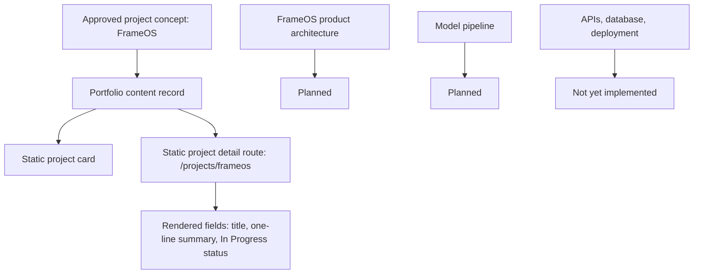

# FrameOS

---

## One-line Summary

FrameOS is an AI-native operating system for autonomous media production.

---

## Elevator Pitch

FrameOS is documented in this repository as an in-progress AI product direction focused on autonomous media production. The approved description is limited to one sentence: "AI-native operating system for autonomous media production."

The project exists in the portfolio as one of four featured projects and is positioned as primary evidence of AI systems direction. The repository does not yet contain a separate FrameOS codebase, project-specific architecture, implementation notes, model details, screenshots, demo links, repository URLs, user outcomes, or metrics.

Someone should care about FrameOS as a declared engineering direction, not as a completed system. The current case study is intentionally honest: it records the concept, the current implementation gap, and the planned technical areas that must be documented before stronger claims can be made.

---

## Problem Statement

Repository-defined problem statement: Planned.

The approved source documents only define the problem domain as autonomous media production. They do not define:

- Target users.
- Existing workflow pain points.
- Current solution limitations.
- Media formats.
- Automation scope.
- Production environment.
- Evaluation criteria.

Why this project was created: Planned.

---

## Goals

### Primary Goals

- Planned.
- The only source-backed goal is to represent an in-progress AI systems project within the portfolio.

### Non-goals

- Do not claim FrameOS is launched, deployed, production-ready, open-sourced, benchmarked, or used by users.
- Do not claim specific media generation, editing, scheduling, orchestration, or operating-system capabilities until documented.
- Do not add screenshots, demos, repository links, metrics, or architecture diagrams as factual evidence until source-backed.

### Design Philosophy

Source-backed portfolio philosophy that applies to this project:

- Products over isolated models.
- Systems over demos.
- Architecture over screenshots.
- Research before implementation.
- Execution over ideas.

Project-specific design philosophy: Planned.

---

## System Overview

Current status: In Progress.

High-level system behavior: Not yet implemented.

The repository currently represents FrameOS as static portfolio content:

- Name: FrameOS.
- Slug: `frameos`.
- Description: AI-native operating system for autonomous media production.
- Status: In Progress.
- Portfolio route: `/projects/frameos`.

Who uses it: Planned.

Expected workflow: Planned.

---

## Architecture

Project architecture: Not yet implemented.

The repository does not define FrameOS subsystems, data flow, request flow, model pipeline, orchestration layer, persistence, APIs, infrastructure, or deployment topology.

Current portfolio architecture for presenting this project:

- `content/projects.ts` stores the source-backed project record.
- `app/projects/[slug]/page.tsx` statically generates the detail route.
- `ProjectHeader` renders only the project name, one-line description, and status.
- `NavigationBetweenProjects` provides static previous/next project links.

Major FrameOS subsystems: Planned.

Data flow: Planned.

Request flow: Planned.

Model pipeline: Planned.

Orchestration: Planned.

---

## Architecture Diagram



---

## End-to-End Workflow

### Current Portfolio Workflow

Input

Portfolio visitor opens `/projects` or `/projects/frameos`.

Processing

The Next.js static route reads the FrameOS record from `content/projects.ts`.

Output

The page displays the project title, one-line description, status, and project navigation.

### FrameOS Product Workflow

Input: Planned.

Processing: Planned.

Output: Planned.

---

## Core Features

### Current Source-backed Feature

FrameOS is listed as a featured in-progress project in the portfolio.

Why it exists: It supports the portfolio's project-first hierarchy and communicates a current AI systems direction.

### Planned Features

Project-specific features are not yet implemented or documented.

Do not infer features such as media generation, timeline editing, asset management, workflow scheduling, agent orchestration, collaboration, publishing, or rendering until source documents define them.

---

## Technical Stack

### Project Implementation Stack

| Area | Status |
| --- | --- |
| Languages | Not yet implemented |
| Frameworks | Not yet implemented |
| Models | Not yet implemented |
| Libraries | Not yet implemented |
| Database | Not yet implemented |
| Deployment | Not yet implemented |
| Infrastructure | Not yet implemented |

### Repository-backed Portfolio Stack

The portfolio that presents FrameOS uses:

- Next.js App Router.
- React.
- TypeScript.
- Tailwind CSS.
- Static generation.
- Vitest and React Testing Library.
- Local typed content modules.

These are portfolio technologies, not evidence of the FrameOS product implementation.

---

## Engineering Decisions

### Decision: Keep project details minimal until source-backed

Problem: The project exists as an in-progress portfolio item, but implementation details are missing.

Options considered:

- Invent architecture and features.
- Omit the project entirely.
- Render only source-backed fields.

Chosen solution: Render only the approved title, one-line description, and `In Progress` status.

Tradeoffs:

- Preserves credibility and avoids false claims.
- Leaves the project case study sparse until real implementation details exist.

### Project-specific engineering decisions

Planned.

---

## AI / ML Pipeline

Model selection: Planned.

Embeddings: Planned.

Retrieval: Planned.

Ranking: Planned.

Inference: Planned.

Evaluation: Planned.

Caching: Planned.

Optimization: Planned.

No AI / ML pipeline implementation for FrameOS exists in this repository.

---

## Folder Structure

### Current Repository Representation

```text
content/projects.ts
types/project.ts
app/projects/[slug]/page.tsx
features/projects/components/ProjectHeader.tsx
features/projects/components/ProjectCard.tsx
features/projects/components/ProjectGrid.tsx
features/projects/components/NavigationBetweenProjects.tsx
```

### FrameOS Product Repository

Not yet implemented.

---

## APIs

FrameOS APIs: Not yet implemented.

No endpoints, request contracts, response contracts, authentication model, rate limits, or API clients are documented in this repository.

---

## Database

Database: Not yet implemented.

Schema: Planned.

Entities: Planned.

Relationships: Planned.

The repository does not define persistence requirements for FrameOS.

---

## Challenges

Documented engineering challenges: Not yet implemented.

Known documentation challenge:

- The project name and one-line summary communicate a direction, but the repository does not yet provide enough evidence to describe architecture, features, model behavior, or operational constraints.

How solved:

- Current portfolio implementation avoids unsupported claims and keeps details minimal until source-backed content exists.

---

## Scalability

Current limitations:

- No product architecture is documented.
- No model pipeline is documented.
- No storage model is documented.
- No deployment model is documented.
- No scale targets are documented.

Future scaling strategy: Planned.

---

## Performance

Project-specific performance work: Not yet implemented.

Optimization techniques: Planned.

No latency, throughput, cost, quality, or benchmark data is documented.

---

## Security

Authentication: Not yet implemented.

Validation: Planned.

Rate limiting: Planned.

Input sanitization: Planned.

Secrets: Not yet implemented.

No security model for FrameOS is documented in this repository.

---

## Testing

Project-specific testing strategy: Not yet implemented.

Coverage: Not yet implemented.

Current portfolio tests validate that FrameOS exists in the project content list with `In Progress` status.

---

## Deployment

Local: Not yet implemented for the FrameOS product.

Docker: Not yet implemented for the FrameOS product.

Production: Not yet implemented.

CI/CD: Not yet implemented.

Only the static portfolio route exists in this repository.

---

## Current Progress

### Completed

- Listed as a featured portfolio project.
- Static project detail route exists.
- Name, slug, one-line description, and status are source-backed.

### In Progress

- Project status is documented as `In Progress`.

### Planned

- Product architecture.
- Feature specification.
- AI / ML pipeline.
- API design.
- Database design.
- Deployment strategy.
- Repository URL.
- Demo URL.
- Screenshots, diagrams, and code snippets.
- Engineering decisions and lessons from implementation.

---

## Roadmap

### Near-term

- Add source-backed project architecture once implementation exists.
- Define actual user workflow.
- Document model, data, and orchestration choices.
- Add repository and demo links only after approved.

### Long-term

- Planned.

---

## Lessons Learned

Engineering lessons: Planned.

Architecture lessons: Planned.

Product lessons: Planned.

No implementation lessons are documented yet.

---

## Future Improvements

- Replace planned sections with source-backed implementation details.
- Add actual architecture diagram.
- Add API contracts if APIs are implemented.
- Add database schema if persistence is implemented.
- Add model pipeline details if AI / ML components are implemented.
- Add testing and deployment evidence once available.

---

## Repository

GitHub link: Not yet implemented.

The global profile GitHub link is `https://github.com/HrshJha`, but no FrameOS repository URL is documented.

---

## Recruiter Takeaways

- FrameOS is an in-progress project direction: AI-native operating system for autonomous media production.
- The portfolio presents it honestly with only source-backed fields.
- Architecture, implementation, model pipeline, repository, demo, and metrics are not yet documented.
- The main signal today is project direction and disciplined avoidance of unsupported claims.
