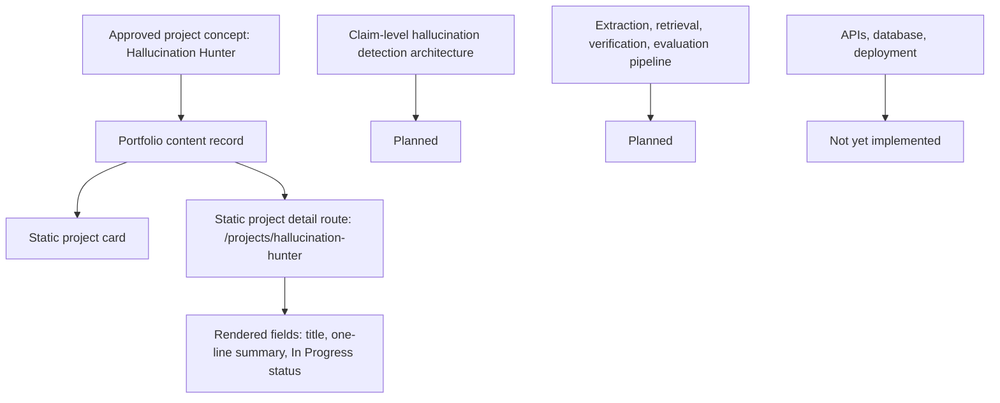

# Hallucination Hunter

---

## One-line Summary

Hallucination Hunter is a claim-level hallucination detection platform.

---

## Elevator Pitch

Hallucination Hunter is documented in this repository as an in-progress AI product direction focused on claim-level hallucination detection. The approved description is limited to one sentence: "Claim-level hallucination detection platform."

This project aligns with repository-backed experience and focus areas: DomAIyn Labs LLP includes AI safety, hallucination detection, LLM evaluation, NLP systems, and retrieval systems as approved highlights. However, the repository does not state that Hallucination Hunter is the same system as that internship work, nor does it provide a separate implementation codebase, model pipeline, evaluation methodology, retrieval architecture, API design, database schema, repository URL, demo URL, screenshots, metrics, or outcomes.

This case study records the project direction and distinguishes it from unsupported implementation claims. It is written to preserve credibility while making clear what must be documented before the project can be evaluated as a built hallucination detection system.

---

## Problem Statement

Repository-defined problem statement: Planned.

The approved documents define the problem domain as claim-level hallucination detection. They do not define:

- Target users.
- Input document or answer format.
- Claim extraction method.
- Evidence source.
- Detection criteria.
- Evaluation dataset.
- Accuracy, precision, recall, or benchmark targets.
- Current solution limitations.

Why this project was created: Planned.

---

## Goals

### Primary Goals

- Planned.
- The only source-backed goal is to represent an in-progress AI systems project within the portfolio.

### Non-goals

- Do not claim Hallucination Hunter extracts claims, retrieves evidence, verifies statements, scores hallucinations, or produces reports until documented.
- Do not claim evaluation results, benchmark scores, model accuracy, production use, or user validation until source-backed.
- Do not claim direct continuity with DomAIyn Labs LLP work unless future source documents explicitly state it.

### Design Philosophy

Source-backed portfolio philosophy that applies to this project:

- Products over isolated models.
- Systems over demos.
- Architecture over screenshots.
- Understanding over memorization.
- Research before implementation.
- Execution over ideas.

Project-specific design philosophy: Planned.

---

## System Overview

Current status: In Progress.

High-level system behavior: Not yet implemented.

The repository currently represents Hallucination Hunter as static portfolio content:

- Name: Hallucination Hunter.
- Slug: `hallucination-hunter`.
- Description: Claim-level hallucination detection platform.
- Status: In Progress.
- Portfolio route: `/projects/hallucination-hunter`.

Who uses it: Planned.

Expected workflow: Planned.

---

## Architecture

Project architecture: Not yet implemented.

The repository does not define claim extraction, evidence retrieval, verification, scoring, model inference, evaluation, caching, persistence, APIs, or deployment topology.

Current portfolio architecture for presenting this project:

- `content/projects.ts` stores the source-backed project record.
- `app/projects/[slug]/page.tsx` statically generates the detail route.
- `ProjectHeader` renders only the project name, one-line description, and status.
- `NavigationBetweenProjects` provides static previous/next project links.

Major subsystems: Planned.

Data flow: Planned.

Request flow: Planned.

Model pipeline: Planned.

Orchestration: Planned.

---

## Architecture Diagram



---

## End-to-End Workflow

### Current Portfolio Workflow

Input

Portfolio visitor opens `/projects` or `/projects/hallucination-hunter`.

Processing

The Next.js static route reads the Hallucination Hunter record from `content/projects.ts`.

Output

The page displays the project title, one-line description, status, and project navigation.

### Hallucination Hunter Product Workflow

Input: Planned.

Processing: Planned.

Output: Planned.

---

## Core Features

### Current Source-backed Feature

Hallucination Hunter is listed as a featured in-progress project in the portfolio.

Why it exists: It supports the portfolio's project-first hierarchy and aligns with documented AI safety, hallucination detection, LLM evaluation, NLP systems, and retrieval systems interests.

### Planned Features

Project-specific features are not yet implemented or documented.

Do not infer features such as claim extraction, evidence retrieval, fact verification, hallucination scoring, report generation, dataset evaluation, or LLM judge workflows until source documents define them.

---

## Technical Stack

### Project Implementation Stack

| Area | Status |
| --- | --- |
| Languages | Not yet implemented |
| Frameworks | Not yet implemented |
| Models | Not yet implemented |
| Libraries | Not yet implemented |
| Database | Not yet implemented |
| Deployment | Not yet implemented |
| Infrastructure | Not yet implemented |

### Repository-backed Portfolio Stack

The portfolio that presents Hallucination Hunter uses:

- Next.js App Router.
- React.
- TypeScript.
- Tailwind CSS.
- Static generation.
- Vitest and React Testing Library.
- Local typed content modules.

These are portfolio technologies, not evidence of the Hallucination Hunter product implementation.

### Related Source-backed Skills and Experience

The repository documents relevant experience highlights:

- AI safety.
- Hallucination detection.
- LLM evaluation.
- FastAPI.
- NLP systems.
- Retrieval systems.

These highlights are associated with DomAIyn Labs LLP, not explicitly with Hallucination Hunter.

---

## Engineering Decisions

### Decision: Keep project details minimal until source-backed

Problem: The project has a specific AI safety direction, but the repository does not document its implementation.

Options considered:

- Invent a hallucination detection pipeline.
- Infer details from related experience.
- Render only source-backed fields.

Chosen solution: Render only the approved title, one-line description, and `In Progress` status.

Tradeoffs:

- Preserves credibility and avoids unsupported evaluation or safety claims.
- Leaves the case study incomplete until real model, retrieval, and evaluation details exist.

### Project-specific engineering decisions

Planned.

---

## AI / ML Pipeline

Model selection: Planned.

Embeddings: Planned.

Retrieval: Planned.

Ranking: Planned.

Inference: Planned.

Evaluation: Planned.

Caching: Planned.

Optimization: Planned.

No AI / ML pipeline implementation for Hallucination Hunter exists in this repository.

---

## Folder Structure

### Current Repository Representation

```text
content/projects.ts
types/project.ts
app/projects/[slug]/page.tsx
features/projects/components/ProjectHeader.tsx
features/projects/components/ProjectCard.tsx
features/projects/components/ProjectGrid.tsx
features/projects/components/NavigationBetweenProjects.tsx
```

### Hallucination Hunter Product Repository

Not yet implemented.

---

## APIs

Hallucination Hunter APIs: Not yet implemented.

No endpoints, request contracts, response contracts, authentication model, rate limits, or API clients are documented in this repository.

---

## Database

Database: Not yet implemented.

Schema: Planned.

Entities: Planned.

Relationships: Planned.

The repository does not define persistence requirements for claims, evidence, documents, retrieval indexes, evaluations, reports, or model outputs.

---

## Challenges

Documented engineering challenges: Not yet implemented.

Known documentation challenge:

- Hallucination detection requires precise evaluation language, but the repository does not yet define models, datasets, evidence sources, scoring criteria, or validation methodology.

How solved:

- Current portfolio implementation avoids unsupported claims and keeps details minimal until source-backed content exists.

---

## Scalability

Current limitations:

- No product architecture is documented.
- No claim/evidence data model is documented.
- No retrieval or evaluation pipeline is documented.
- No deployment model is documented.
- No scale targets are documented.

Future scaling strategy: Planned.

---

## Performance

Project-specific performance work: Not yet implemented.

Optimization techniques: Planned.

No latency, throughput, retrieval quality, evaluation quality, cost, or benchmark data is documented.

---

## Security

Authentication: Not yet implemented.

Validation: Planned.

Rate limiting: Planned.

Input sanitization: Planned.

Secrets: Not yet implemented.

The repository does not define document privacy, evidence-source access, input validation, or abuse prevention for Hallucination Hunter.

---

## Testing

Project-specific testing strategy: Not yet implemented.

Coverage: Not yet implemented.

Current portfolio tests validate that Hallucination Hunter exists in the project content list with `In Progress` status.

---

## Deployment

Local: Not yet implemented for the Hallucination Hunter product.

Docker: Not yet implemented for the Hallucination Hunter product.

Production: Not yet implemented.

CI/CD: Not yet implemented.

Only the static portfolio route exists in this repository.

---

## Current Progress

### Completed

- Listed as a featured portfolio project.
- Static project detail route exists.
- Name, slug, one-line description, and status are source-backed.

### In Progress

- Project status is documented as `In Progress`.

### Planned

- Product architecture.
- Feature specification.
- AI / ML pipeline.
- Claim extraction and verification design.
- Retrieval and evaluation strategy.
- API design.
- Database design.
- Security model.
- Deployment strategy.
- Repository URL.
- Demo URL.
- Screenshots, diagrams, and code snippets.

---

## Roadmap

### Near-term

- Define source-backed user workflow.
- Document actual claim-level detection architecture.
- Define retrieval, verification, and evaluation methodology if implemented.
- Add repository and demo links only after approved.

### Long-term

- Planned.

---

## Lessons Learned

Engineering lessons: Planned.

Architecture lessons: Planned.

Product lessons: Planned.

No implementation lessons are documented yet.

---

## Future Improvements

- Replace planned sections with source-backed implementation details.
- Add actual architecture diagram.
- Add API contracts if APIs are implemented.
- Add database schema if persistence is implemented.
- Add model pipeline details if AI / ML components are implemented.
- Add testing and deployment evidence once available.

---

## Repository

GitHub link: Not yet implemented.

The global profile GitHub link is `https://github.com/HrshJha`, but no Hallucination Hunter repository URL is documented.

---

## Recruiter Takeaways

- Hallucination Hunter is an in-progress project direction: claim-level hallucination detection platform.
- It aligns with documented AI safety, hallucination detection, LLM evaluation, NLP systems, and retrieval systems interests.
- The repository does not yet document implementation, evaluation, repository, demo, metrics, or deployment.
- The main signal today is technical direction plus disciplined avoidance of unsupported AI safety claims.
